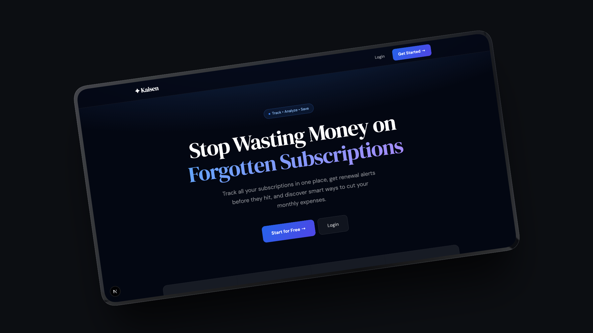
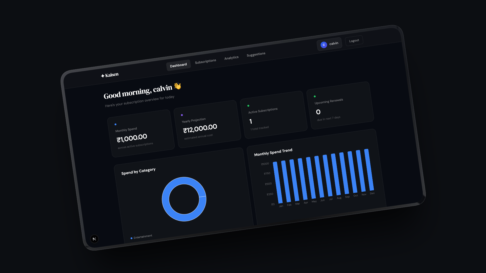
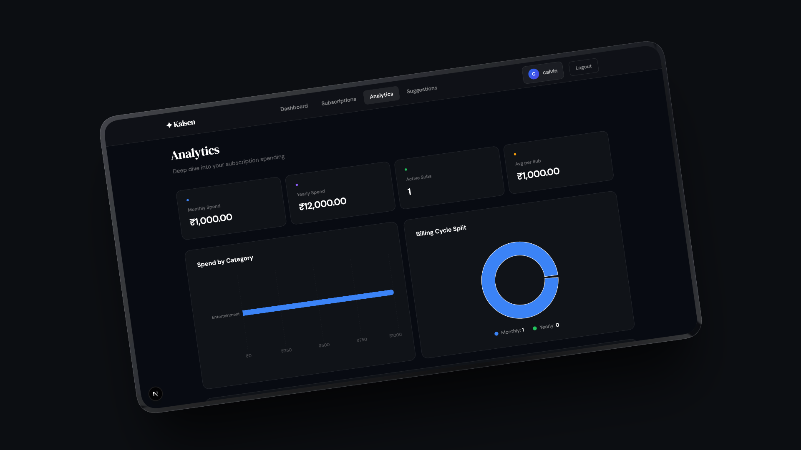
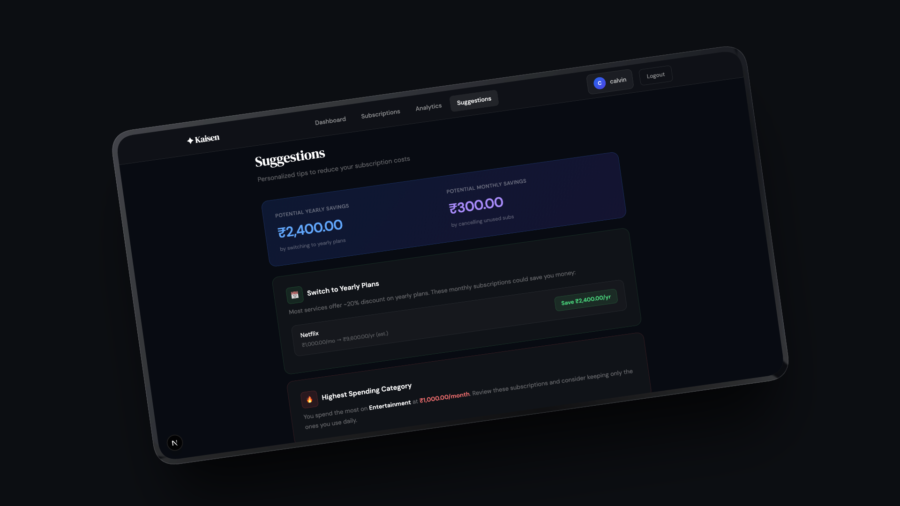

# ✦ Kaisen

> A professional subscription tracking app built to help you track, analyze, and reduce your monthly expenses — inspired by the Japanese philosophy of continuous improvement (*Kaizen*).

## 📸 Preview

### Landing Page


### Dashboard


### Analytics


### Suggestions


---

## ✨ Features

- **📊 Smart Dashboard** — View monthly/yearly spend, active subscriptions, and upcoming renewals at a glance
- **💳 Subscription Management** — Add, edit, delete, and filter subscriptions by status (active, paused, cancelled)
- **📈 Analytics Page** — Horizontal bar charts, pie charts, most expensive subscriptions, and category breakdown table
- **💡 Cost Suggestions** — Personalized tips including duplicate category detection, yearly plan savings, free alternatives, and general money-saving advice
- **🔔 Renewal Alerts** — Color-coded countdown showing days until next payment (red = urgent, yellow = soon, green = safe)
- **🔒 Authentication** — Secure signup/login with encrypted passwords using NextAuth + bcrypt
- **🛡️ Route Protection** — Middleware-protected routes redirect unauthenticated users to login
- **🎨 Professional UI** — Dark corporate design with DM Serif Display + DM Sans typography

---

## 🛠️ Tech Stack

| Layer | Technology |
|-------|-----------|
| Framework | Next.js 15 (App Router) |
| Styling | Tailwind CSS v4 |
| Database | PostgreSQL (Neon) |
| ORM | Prisma 5 |
| Auth | NextAuth.js v4 + bcryptjs |
| Charts | Recharts |
| Deployment | Vercel |

---

## 📁 Project Structure

```
kaisen/
├── app/
│   ├── page.jsx                  # Landing page
│   ├── layout.jsx                # Root layout
│   ├── globals.css               # Global styles
│   ├── dashboard/
│   │   └── page.jsx              # Dashboard with charts
│   ├── subscriptions/
│   │   └── page.jsx              # Subscription CRUD
│   ├── analytics/
│   │   └── page.jsx              # Analytics & insights
│   ├── suggestions/
│   │   └── page.jsx              # Cost-cutting suggestions
│   ├── auth/
│   │   ├── login/page.jsx        # Login page
│   │   └── signup/page.jsx       # Signup page
│   └── api/
│       ├── auth/[...nextauth]/   # NextAuth handler
│       ├── auth/signup/          # Signup API route
│       └── subscriptions/        # CRUD API routes
├── components/
│   ├── Navbar.jsx                # Navigation bar
│   ├── NavbarWrapper.jsx         # Hides navbar on auth pages
│   ├── SessionProvider.jsx       # NextAuth session wrapper
│   ├── SubscriptionCard.jsx      # Subscription card component
│   └── SubscriptionForm.jsx      # Add/edit form component
├── lib/
│   ├── db.js                     # Prisma client singleton
│   └── helpers.js                # Date & currency utilities
├── prisma/
│   └── schema.prisma             # Database schema
├── proxy.js                      # Route protection middleware
└── .env                          # Environment variables
```

---

## 🚀 Getting Started

### Prerequisites

- Node.js v18+
- A [Neon](https://neon.tech) account (free PostgreSQL)

### 1. Clone the repository

```bash
git clone https://github.com/yourusername/kaisen.git
cd kaisen
```

### 2. Install dependencies

```bash
npm install
```

### 3. Set up environment variables

Create a `.env` file in the root:

```env
DATABASE_URL="your-neon-postgresql-connection-string"
NEXTAUTH_SECRET="your-secret-key"
NEXTAUTH_URL="http://localhost:3000"
```

### 4. Push database schema

```bash
npx prisma db push
```

### 5. Run the development server

```bash
npm run dev
```

Open [http://localhost:3000](http://localhost:3000) in your browser.

---

## 🗄️ Database Schema

```prisma
model User {
  id            String         @id @default(cuid())
  name          String
  email         String         @unique
  password      String
  createdAt     DateTime       @default(now())
  subscriptions Subscription[]
}

model Subscription {
  id           String   @id @default(cuid())
  name         String
  amount       Float
  currency     String   @default("INR")
  billingCycle String
  startDate    DateTime
  nextPayDate  DateTime
  category     String
  status       String   @default("active")
  notes        String?
  website      String?
  createdAt    DateTime @default(now())
  updatedAt    DateTime @updatedAt
  userId       String
  user         User     @relation(fields: [userId], references: [id], onDelete: Cascade)
}
```

---

## 📡 API Routes

| Method | Endpoint | Description |
|--------|----------|-------------|
| POST | `/api/auth/signup` | Register a new user |
| POST | `/api/auth/signin` | Login (NextAuth) |
| GET | `/api/subscriptions` | Get all user subscriptions |
| POST | `/api/subscriptions` | Create a new subscription |
| PUT | `/api/subscriptions/:id` | Update a subscription |
| DELETE | `/api/subscriptions/:id` | Delete a subscription |

---

## 🔐 Authentication Flow

```
Signup → Password encrypted with bcrypt → Saved to DB
Login  → NextAuth verifies credentials → JWT session created
Pages  → Middleware checks session → Redirect if unauthenticated
```

---

## 💡 Key Concepts Learned

- **Next.js App Router** — File-based routing with layouts, pages, and API routes
- **Server vs Client Components** — When to use `"use client"` directive
- **Prisma ORM** — Database modeling and querying with JavaScript
- **NextAuth.js** — Session management with JWT and credentials provider
- **bcrypt** — Secure password hashing
- **Recharts** — Data visualization with React components
- **Middleware** — Route protection for authenticated pages

---

## 🙌 Acknowledgements

- [Next.js](https://nextjs.org/)
- [Neon](https://neon.tech/)
- [Prisma](https://www.prisma.io/)
- [NextAuth.js](https://next-auth.js.org/)
- [Recharts](https://recharts.org/)
- [Tailwind CSS](https://tailwindcss.com/)

---

## 📄 License

MIT License — feel free to use this project for learning or as a portfolio piece.

---